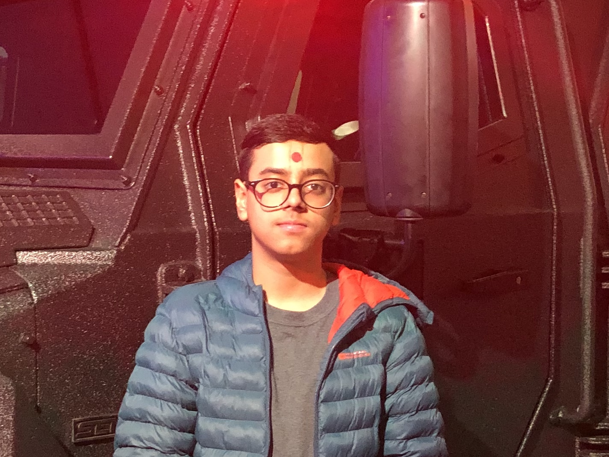

⭐️ I am [Jayprakash Pathak](https://github.com/jayprakash07/), a 17 year old developer with broad exprience in software development and project management, developed through multiple hackathon-winning projects. Most of my projects consist of web-applications accessible to anyone on the Internet, but I have also looked into application development💻 , competitive programming 🥇, ethical hacking and Ai/Machine Learning. Visit [my site](https://www.jayprakashpathak.me) to learn more about me!

- 🌱 I’m currently learning everything. 🤣
- 👯 I’m looking to collaborate with others for projects.
- 📝 I write articles on Medium for beginners learning to code.
- 🥅 2021 Goals: Learn and develop more projects.
- ⚡ Fun fact: I like to build computers and play drums.

### 🤝 Connect with me! 
  <a href="mailto:jayprakashpathak07@gmail.com" alt="Contact me">

### 🚀 Languages I've Used: 
     

### ⚙️ Tools I've Used:
     

### Hackathons I've Done:

---

### 📝 Latest Articles:

<!-- BLOG-POST-LIST:START -->
- [For a Beginner: Should I learn Java or Python?](https://medium.datadriveninvestor.com/for-a-beginner-should-i-learn-c-or-python-186f200723b5)
<!-- BLOG-POST-LIST:END -->

➡️ [more blog posts...](https://medium.com/@jayprakashpathak07)

---

